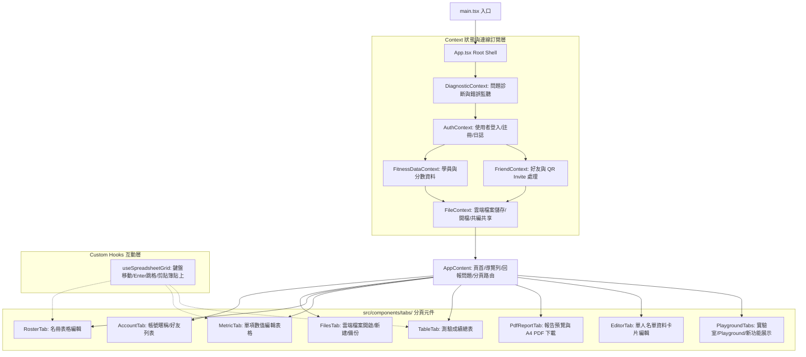

# 體適能測驗管理工具 - 架構與模組化重構指引
# (Architecture & Refactoring Guide)

這份文件記錄了本專案從 **單體架構 (Monolith)** 重構為 **模組化架構 (Modular Architecture)** 的設計決策、架構圖、各模組職責，以及未來的開發指引。目的是讓後續接手的開發人員或 AI 助理（Session）能快速理解系統運作方式並無縫接軌。

---

## 1. 重構背景與動機

### 重構前：單體 App.tsx (7,200+ 行)
在重構之前，專案所有的狀態管理、Firebase 即時資料訂閱、Excel 試算表鍵盤事件監聽，以及多達 8 個分頁的 JSX 渲染，全部寫在單一的 `src/App.tsx` 檔案中。這帶來了以下問題：
* **狀態爆炸與重複渲染效能瓶頸**：共有將近 60 個 React State。任何一個無關的狀態變更（例如：收到好友邀請）都會迫使整個巨大的 DOM 樹（包含複雜的試算表與 Apache ECharts 雷達圖）重新渲染。
* **試算表邏輯重複**：名冊、測驗項目與測驗總表皆需處理鍵盤上下鍵移動、Enter 跳格與貼上（Paste TSV）功能，這些功能散落在各處且程式碼高度重複。
* **程式碼規模龐大**：單一檔案過大導致編輯器載入緩慢、搜尋不易，且修改其中一個功能（例如帳號管理）極易不小心破壞其他無關的功能（例如試算表格子編輯）。

### 重構後：職責分離與上下文驅動
我們將狀態移入對應的 **React Context Providers**，將重複的試算表格子操作抽離成 **Custom Hook**，並將各分頁畫面獨立成 **Tab Components**。原本的 `App.tsx` 僅保留極簡的外殼路由與彈出面板。

---

## 2. 架構設計與資料流

重構後的系統採用以下的分層依賴結構。在 React 樹中，Provider 的嵌套順序嚴格遵循依賴關係：

```
DiagnosticProvider (最外層：捕捉全域錯誤與載入檢查點)
 └── AuthProvider (提供目前登入者、暱稱與系統日誌寫入方法)
      ├── FitnessDataProvider (管理學員名單、分數資料與排序狀態)
      ├── FriendProvider (管理好友列表、條碼生成與收發好友邀請)
      └── FileProvider (最內層：協調雲端檔案儲存、載入與共享，依賴上述所有 Context)
           └── AppContent (App 外殼：負責主選單、回報問題面板與分頁路由)
```

### 系統架構圖 (Mermaid)



---

## 3. 各模組職責詳解

### A. Context Providers (`src/context/`)

每個 Context Provider 負責對應的領域狀態與 Firebase `onSnapshot` 訂閱，並提供自訂 Hook 供子元件調用：

1. **[DiagnosticContext.tsx](file:///D:/VSCode/fitness-test-tool/src/context/DiagnosticContext.tsx) (`useDiagnostics`)**
   * **職責**：前端啟動檢查點（Frontend check-points）、錯誤捕獲監聽器、系統連線測試與問題回報單提交。
   * **狀態**：`loadCheckpoints`, `frontendIssues`, `showDiagnosticPanel`（回報問題面板開關）。

2. **[AuthContext.tsx](file:///D:/VSCode/fitness-test-tool/src/context/AuthContext.tsx) (`useAuth`)**
   * **職責**：Firebase Auth 狀態監聽、登入與註冊 API、本地暱稱快取，以及全域 `writeAppSystemLog` 寫入。
   * **狀態**：`currentUser`, `currentProfile`, `authReady`, `loginUsername`, `loginPassword`, `showLoginPanel`。

3. **[FitnessDataContext.tsx](file:///D:/VSCode/fitness-test-tool/src/context/FitnessDataContext.tsx) (`useFitnessData`)**
   * **職責**：儲存目前的班級資料結構（`AppData`）、維護名冊與分數的編輯狀態（如正在編輯的格子與篩選器狀態），並提供能力對應表（`abilityRulesConfig`）的雲端更新訂閱。
   * **狀態**：`data` (包含 records 與 rosterEntries), `selectedId`（選中的學生 ID）, `activeCell`, `rosterDraft`（名冊草稿）, `tableSortKey`。

4. **[FriendContext.tsx](file:///D:/VSCode/fitness-test-tool/src/context/FriendContext.tsx) (`useFriends`)**
   * **職責**：管理與其他老師的好友關係、即時監聽好友邀請通知、生成加好友專用的 QR Code 與處理條碼跳轉。
   * **狀態**：`friends`, `incomingFriendRequests`, `outgoingFriendRequests`, `activeFriendInvite`。

5. **[FileContext.tsx](file:///D:/VSCode/fitness-test-tool/src/context/FileContext.tsx) (`useFiles`)**
   * **職責**：管理該帳號下的所有雲端 Class Files，追蹤檔案儲存狀態與 dirty flag，提供開檔、建檔、共編（Collaborators）分享等複雜操作。
   * **狀態**：`cloudFiles`, `currentCloudFileId`, `isCloudDirty`, `showFileSwitcher`。

---

### B. Custom Hooks (`src/hooks/`)

* **[useSpreadsheetGrid.ts](file:///D:/VSCode/fitness-test-tool/src/hooks/useSpreadsheetGrid.ts)**
   * **職責**：將類 Excel 試算表的格子操作封裝。
   * **提供方法**：
     * `useIndexSpreadsheetGrid`：供使用 **「Row Index + Column Index」** 作為定位的試算表使用（例如學員名冊，格子不綁定學生 ID）。
     * `useIdSpreadsheetGrid`：供使用 **「Student Record ID + Field Name」** 作為定位的試算表使用（例如測驗總表、測驗項目表格）。
     * `parseClipboardGrid` / `applyGridPaste`：剪貼簿 TSV 格式解析與跨單元格批量更新演算法。

---

### C. Tab Components (`src/components/tabs/`)

原本 `App.tsx` 中的分頁 JSX 均已拆分為獨立元件，降低了 UI 的複雜度。每個元件都定義了清晰的 `Props` 介面（例如 `setMessage` 與頁面切換控制）：

* **[AccountTab.tsx](file:///D:/VSCode/fitness-test-tool/src/components/tabs/AccountTab.tsx)**：處理個人暱稱儲存、新增好友輸入、條碼生成與處理已收發的好友邀請。
* **[FilesTab.tsx](file:///D:/VSCode/fitness-test-tool/src/components/tabs/FilesTab.tsx)**：處理雲端檔案切換清單、建檔表單、共享權限列表設定。
* **[RosterTab.tsx](file:///D:/VSCode/fitness-test-tool/src/components/tabs/RosterTab.tsx)**：班級名冊與基本資料（身高、體重）的輸入表格，套用了名冊專用的 `useIndexSpreadsheetGrid`。
* **[MetricTab.tsx](file:///D:/VSCode/fitness-test-tool/src/components/tabs/MetricTab.tsx)**：針對立定跳遠、坐姿體前彎等單一項目的數值編輯表格。
* **[TableTab.tsx](file:///D:/VSCode/fitness-test-tool/src/components/tabs/TableTab.tsx)**：大班/中班測驗總表編輯器，整合篩選功能，套用了 `useIdSpreadsheetGrid`。
* **[PdfReportTab.tsx](file:///D:/VSCode/fitness-test-tool/src/components/tabs/PdfReportTab.tsx)**：整合 [A4CanvasBoard.tsx](file:///D:/VSCode/fitness-test-tool/src/A4CanvasBoard.tsx)，選中單一學生可預覽雷達圖與評語，並提供下載全班 PDF 的按鈕。
* **[EditorTab.tsx](file:///D:/VSCode/fitness-test-tool/src/components/tabs/EditorTab.tsx)**：非表格形式的單人資料編輯表單。
* **[PlaygroundTabs.tsx](file:///D:/VSCode/fitness-test-tool/src/components/tabs/PlaygroundTabs.tsx)**：放置實驗性質分頁（Vite/Excel Playground 等非正式生產環境頁面）。

---

## 4. 未來開發與維護指引

如果您在新的 Session 中接手本專案，想要新增功能，請遵循以下模式：

### 如何新增一個狀態 (React State)？
1. **分析狀態的作用域**：
   * 如果是**只在單一分頁內使用**的狀態（例如：PDF 分頁中「選擇哪一位學生」），請直接寫在該分頁元件（如 `PdfReportTab.tsx`）的 `useState` 中。
   * 如果是**跨分頁共用**的狀態（例如：登入使用者、目前開啟的檔案資料、全域提示文字），請至 `src/context/` 底下對應的 Provider 中新增。

### 如何新增一個分頁 (Tab)？
1. 在 `src/App.tsx` 中的 `TabKey` 型別宣告新增一個字串（例如 `"analytics"`）。
2. 在 `tabs` 陣列或 `experimentalTabs` 中新增該分頁的物件定義（包含 `key` 與頁面標籤 `label`）。
3. 在 `src/components/tabs/` 下建立新的 `.tsx` 元件。
4. 在 `src/App.tsx` 中的 `AppContent` 路由分支內導入並渲染該元件。

### 如何確保資料一致性與 dirty 標記？
* 系統對雲端檔案的編輯採用 `isCloudDirty` 狀態（定義於 `FileContext`）。
* 在進行分頁切換時，`App.tsx` 的 `handleTabChange` 函數會自動比對名冊草稿或檢查 `isCloudDirty`。如果檔案已被變更但未儲存，會跳出 `confirm` 視窗提示使用者儲存。
* **開發新規劃時**：如果您新增了會直接改寫資料（`data`）的表單或編輯器，請務必在改寫時將 `isCloudDirty` 設定為 `true`。

---

## 5. 常規驗證指令

在新增完任何功能後，請務必執行以下指令以確保型別安全與功能正常：

```bash
# 1. TypeScript 型別檢查
pnpm tsc -b

# 2. 本地開發伺服器啟動
pnpm dev

# 3. 測試生產環境打包 (Vite Build)
pnpm build
```
